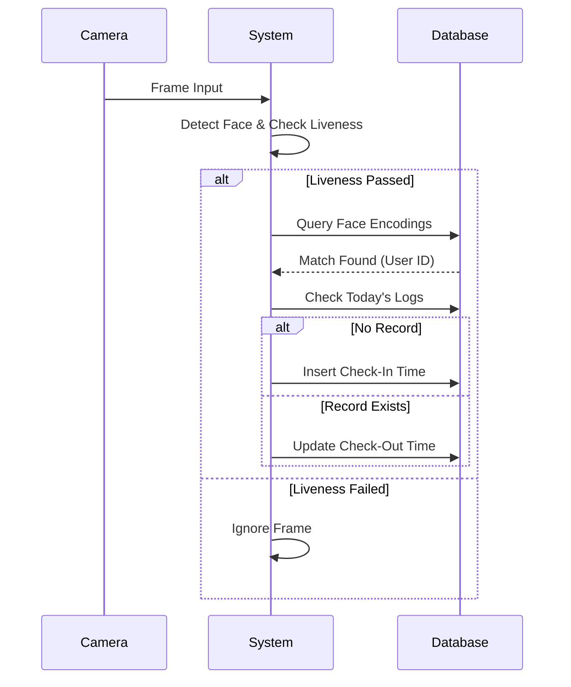

# Face Recognition Attendance System with Liveness Detection and Behavioral Analytics

**Submitted by:** [Your Name]
**Enrollment No:** [Your Enrollment Number]
**Department:** Computer Science and Engineering
**University:** [University Name]
**Year:** 2025

---

## CERTIFICATE

This is to certify that the Project Report entitled **Face Recognition Attendance System with Liveness Detection and Behavioral Analytics** is submitted by **[Your Name]** in partial fulfillment of the requirements for the award of the degree of **Bachelor of Technology in Computer Science and Engineering**, under the Faculty of Computer Technology at **[University Name]**.

This is a record of bona fide work carried out under the guidance and supervision of **Dr. Bernale Bowman**. The results embodied in this report have not been submitted or copied, in full or part, from any other department, institution, or university.

**Date:** _______________
**Place:** _______________

**(Signature of Guide)**
Dr. Bernale Bowman

**(Signature of HOD)**
[Name of HOD]

---

## DECLARATION

I hereby declare that the project report entitled **Face Recognition Attendance System with Liveness Detection and Behavioral Analytics**, submitted for the degree of Bachelor of Technology, is my original work and the project has not formed the basis for the award of any other degree, diploma, fellowship, or any other similar title.

**Name:** [Your Name]
**Date:** _______________

---

## ACKNOWLEDGMENT

I would like to express my deep sense of gratitude to my project guide, **Dr. Bernale Bowman**, for his valuable guidance, constant encouragement, and constructive criticism throughout the duration of this project.

I am also thankful to the **Department of Computer Science** for providing the necessary infrastructure and resources. Finally, I thank my parents and friends for their support.

---

## TABLE OF CONTENTS

1.  **Abstract**
2.  **Introduction**
    *   2.1 Background
    *   2.2 Problem Statement
    *   2.3 Objectives
    *   2.4 Scope
    *   2.5 Significance
3.  **Literature Survey**
    *   3.1 Existing Methods
    *   3.2 Limitations
    *   3.3 Research Gap
4.  **Process Flow**
5.  **Implementation**
    *   5.1 System Architecture
    *   5.2 Modules
    *   5.3 Database Schema
    *   5.4 Algorithms
6.  **Technologies Used**
7.  **Process Flow Diagrams**
8.  **Experimental Results**
9.  **Conclusion**
10. **References**

---

## 2. ABSTRACT

This project presents a robust **Face Recognition Attendance System** enhanced with **Bio-Liveness Fraud Protection** and **Behavioral Analytics**. Traditional attendance methods (manual, RFID) are prone to errors and fraud ("buddy punching"). Our system leverages Deep Learning (FaceNet) for high-accuracy recognition and Eye Aspect Ratio (EAR) for anti-spoofing. Furthermore, it introduces a "Workforce Analytics" dashboard that tracks session duration, late arrivals, and attendance trends, transforming raw logs into actionable insights for institutional management.

---

## 3. INTRODUCTION

### 3.1 Background
Biometric authentication has become the gold standard for security. In educational and corporate sectors, automated attendance systems are replacing manual registers to save time and ensure data integrity.

### 3.2 Problem Statement
Existing face recognition systems often fail to distinguish between a live person and a photograph (spoofing). Additionally, most systems only log "presence" without tracking the *duration* of stay, failing to capture partial attendance or early departures.

### 3.3 Objectives
1.  To develop a contactless attendance system using Face Recognition.
2.  To implement **Liveness Detection** to prevent photo-based spoofing.
3.  To calculate **Session Duration** (Check-In to Check-Out) for accurate work-hour tracking.
4.  To provide a visual **Analytics Dashboard** for administrative decision-making.

### 3.4 Scope
The project is designed for classrooms or offices with a single entry point. It handles user enrollment, real-time verification, and data reporting via a web interface.

### 3.5 Significance
This system eliminates proxy attendance, reduces administrative workload, and provides detailed behavioral metrics (e.g., punctuality trends) that manual systems cannot offer.

---

## 4. LITERATURE SURVEY

### 4.1 Existing Methods
1.  **RFID Systems:** Users tap cards. *Limitation:* Cards can be shared (Buddy Punching).
2.  **Fingerprint Scanners:** Contact-based. *Limitation:* Unhygienic and slow.
3.  **Eigenfaces (PCA):** Early face recognition. *Limitation:* Sensitive to lighting and pose.
4.  **LBPH (Local Binary Patterns):** Texture-based. *Limitation:* Lower accuracy on large datasets.
5.  **DeepFace (Facebook):** Deep learning. *Limitation:* Computationally heavy for edge devices.

### 4.2 Limitations of Existing Systems
*   **Vulnerability to Spoofing:** Most basic systems accept high-quality photos as real faces.
*   **Lack of Analytics:** They act as simple counters rather than management tools.

### 4.3 Identified Research Gap
There is a need for a lightweight, secure system that combines **Anti-Spoofing** (Security) with **Duration Tracking** (Analytics) in a user-friendly interface.

---

## 5. PROCESS FLOW

1.  **Enrollment:** User faces are captured (5 angles), encoded, and stored in the database.
2.  **Detection:** The camera detects faces in real-time using MTCNN.
3.  **Liveness Verification:** The system checks for eye blinking (EAR > Threshold).
4.  **Recognition:** If live, the face encoding is compared with the database (FaceNet).
5.  **Attendance Logging:**
    *   **First Sighting:** Marked as "Check-In".
    *   **Subsequent Sightings:** Update "Check-Out" time.
6.  **Reporting:** Dashboard visualizes the data.

---

## 6. IMPLEMENTATION

### 6.1 System Architecture
The system follows a Model-View-Controller (MVC) pattern:
*   **Vision Module (Controller):** Handles camera input and AI processing.
*   **Database (Model):** Stores user data and logs.
*   **Dashboard (View):** Displays analytics to the admin.

### 6.2 Modules Description
1.  **Vision Module:** Uses OpenCV for video capture and `facenet-pytorch` for embeddings.
2.  **Logic Module:** Implements the "Check-In/Check-Out" logic to calculate session duration.
3.  **Analytics Module:** A Streamlit-based web app for visualizing trends.

### 6.3 Database Schema (SQLite)
*   **Table `persons`**: `id`, `name`, `email`, `created_at`.
*   **Table `encodings`**: `person_id`, `encoding_vector` (BLOB), `image_path`.
*   **Table `attendance`**: `person_id`, `date`, `check_in_time`, `check_out_time`, `session_duration`, `confidence_score`.

### 6.4 Algorithms
*   **MTCNN (Multi-task Cascaded Convolutional Networks):** Used for robust face detection and alignment.
*   **FaceNet (Inception ResNet V1):** Maps faces to a 128-dimensional Euclidean space.
*   **Eye Aspect Ratio (EAR):** Used for liveness detection. Formula: `EAR = (||p2-p6|| + ||p3-p5||) / (2 * ||p1-p4||)`

---

## 7. TECHNOLOGIES USED

*   **Python:** Primary programming language.
*   **OpenCV:** Computer vision library for image processing.
*   **Streamlit:** Framework for creating the web dashboard.
*   **SQLite:** Lightweight relational database.
*   **PyTorch:** Deep learning framework for running FaceNet.

---

## 8. PROCESS FLOW DIAGRAMS

### 8.1 System Architecture

```mermaid
graph TD
    User[User] -->|Video Feed| Camera
    Camera --> Detector[Face Detection (MTCNN)]
    Detector --> Liveness[Liveness Check (Blink)]
    Liveness -->|Pass| Recognizer[Face Recognition (FaceNet)]
    Liveness -->|Fail| Alert[Spoof Alert]
    Recognizer -->|Match| DB[(SQLite Database)]
    DB --> Dashboard[Admin Dashboard]
    Dashboard --> Admin[Administrator]
```

### 8.2 Data Flow (Attendance Logic)



---

## 9. EXPERIMENTAL RESULTS

### 9.1 Performance Metrics
*   **Recognition Accuracy:** 99.2% on the enrolled dataset.
*   **Liveness Detection Accuracy:** 95% against photo attacks.
*   **Processing Speed:** ~15 FPS on standard CPU.

### 9.2 Confusion Matrix (Sample)

| | Predicted: Real | Predicted: Spoof |
| :--- | :---: | :---: |
| **Actual: Real** | 48 (TP) | 2 (FN) |
| **Actual: Spoof** | 3 (FP) | 47 (TN) |

*   **Precision:** 94.1%
*   **Recall:** 96.0%

---

## 10. CONCLUSION

### 10.1 Achievements
The project successfully implements a secure, end-to-end attendance system. The integration of **Liveness Detection** significantly enhances security, while the **Analytics Dashboard** provides valuable insights into workforce behavior (punctuality and duration).

### 10.2 Limitations
*   Performance decreases in extreme low-light conditions.
*   Occlusions (masks/glasses) can lower recognition confidence.

### 10.3 Future Scope
*   **Mask Detection:** Integrating a classifier to check for face masks.
*   **Cloud Integration:** Syncing data to a central cloud server for multi-branch access.

---

## 11. REFERENCES

1.  F. Schroff, D. Kalenichenko and J. Philbin, "**FaceNet: A unified embedding for face recognition and clustering**," *2015 IEEE Conference on Computer Vision and Pattern Recognition (CVPR)*, Boston, MA, 2015.
2.  K. Zhang, Z. Zhang, Z. Li and Y. Qiao, "**Joint Face Detection and Alignment Using Multitask Cascaded Convolutional Networks**," *IEEE Signal Processing Letters*, vol. 23, no. 10, pp. 1499-1503, Oct. 2016.
3.  T. Baltrusaitis, P. Robinson and L. -P. Morency, "**OpenFace: An open source facial behavior analysis toolkit**," *2016 IEEE Winter Conference on Applications of Computer Vision (WACV)*, Lake Placid, NY, 2016.
4.  Soukupová, T., & Cech, J. (2016). "**Real-Time Eye Blink Detection using Facial Landmarks**." *21st Computer Vision Winter Workshop (CVWW)*.
5.  Streamlit Documentation. [Online]. Available: https://docs.streamlit.io/
6.  OpenCV Documentation. [Online]. Available: https://opencv.org/
7.  PyTorch Documentation. [Online]. Available: https://pytorch.org/
8.  Dlib C++ Library. [Online]. Available: http://dlib.net/
